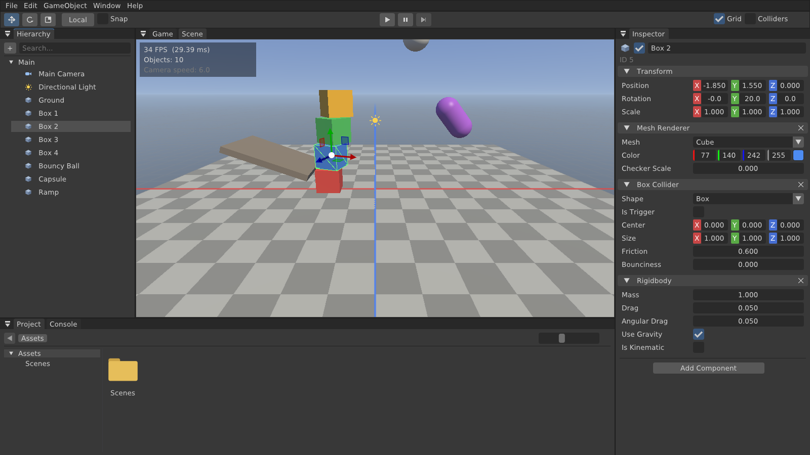
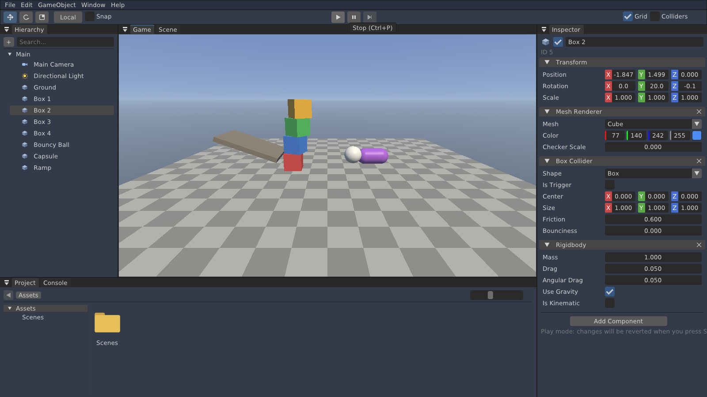

# ZEngine

Игровой движок в стиле Unity: ядро на C++20 и Vulkan 1.3, физика Jolt, редактор на Dear ImGui. Скрипты на C# в разработке.



## Возможности

**Редактор** (`ZEngine-Editor`)
- Панели как в Unity: **Hierarchy**, **Inspector**, **Scene**, **Game**, **Project** (проводник по ассетам) и **Console**. Панели можно перетаскивать и стыковать, раскладка сохраняется (Window → Reset Layout сбрасывает её).
- Создание объектов: меню **GameObject** → Create Empty / 3D Object (Cube, Sphere, Capsule, Cylinder, Plane, Quad) / Light / Camera, кнопка «+» или ПКМ в Hierarchy.
- Inspector: имя, активность, Transform (позиция, поворот в градусах, масштаб), компоненты **Mesh Renderer**, **Box/Sphere/Capsule Collider**, **Rigidbody**, **Light**, **Camera**; кнопка **Add Component**, удаление компонента крестиком. Без выделения показываются настройки сцены (ambient, гравитация).
- Scene view: выбор объектов кликом, гизмо **перемещения/поворота/масштаба** (W/E/R, Local/Global, привязка Snap или Ctrl), сетка, подсветка выделения, каркасы коллайдеров, иконки света и камер.
- **Play / Pause / Step / Stop**: в Play Mode работает физика и открывается окно Game; после Stop сцена возвращается к состоянию до запуска, как в Unity.
- Сцены хранятся в JSON (`*.zscene`) в папке `Project/Assets`: File → New / Open / Save / Save As, двойной клик по сцене в Project, запрос о несохранённых изменениях.
- Project: дерево папок, иконки, навигация, создание папок и сцен, переименование, удаление, «Show in Explorer».
- Console: все сообщения движка с фильтрами Info / Warnings / Errors.

**Движок**
- Рендер на **Vulkan 1.3**: dynamic rendering, synchronization2, VMA, off-screen render targets для окон Scene/Game, процедурное небо, освещение Blinn-Phong, туман, редакторская сетка.
- **Физика Jolt Physics**: статические, динамические и кинематические тела, коллайдеры Box/Sphere/Capsule со смещением, трение, упругость, масса, затухание, триггеры, raycast.
- Unity-совместимые соглашения: левосторонняя система координат, +Y вверх, +Z вперёд, углы Эйлера Z-X-Y, цвета в sRGB.



## Горячие клавиши редактора

| Клавиши | Действие |
|---|---|
| ПКМ + WASD / Q E | полёт камеры (Shift — быстрее, колесо при полёте — скорость) |
| СКМ | панорамирование, колесо — приближение |
| F / двойной клик в Hierarchy | показать выделенный объект |
| W / E / R | перемещение / поворот / масштаб |
| Ctrl+D, Delete, F2 | дублировать, удалить, переименовать |
| Ctrl+P, Ctrl+Shift+P | Play/Stop, пауза |
| Ctrl+S, Ctrl+Shift+S, Ctrl+N | сохранить, сохранить как, новая сцена |

## Готовая сборка

Скачайте архив из [Releases](https://github.com/zdaemon124/zdaemon124/releases), распакуйте и запустите `ZEngine-Editor.exe`.

## Сборка из исходников (Windows 11)

1. Установите:
   - [Visual Studio 2022 или 2026](https://visualstudio.microsoft.com/) с нагрузкой **«Разработка классических приложений на C++»**;
   - [Vulkan SDK](https://vulkan.lunarg.com/sdk/home#windows);
   - [Git](https://git-scm.com/download/win).
2. В «Developer PowerShell for VS»:

   ```powershell
   git clone https://github.com/zdaemon124/zdaemon124.git ZEngine
   cd ZEngine
   cmake --preset windows
   cmake --build --preset windows-debug
   .\build\bin\Debug\ZEngine-Editor.exe
   ```

   Или откройте `build\ZEngine.sln` (`.slnx` для VS 2026) и нажмите F5 — стартовый проект Editor.

## Структура

```
Engine/Source/ZEngine/
  Core/      Application, Window, Input, Log, Platform
  Renderer/  VulkanContext, Swapchain, Pipeline, Renderer (render targets), Mesh
  Scene/     Scene, Entity, компоненты, Transform, Camera, Primitives, SceneSerializer
  Physics/   PhysicsWorld (Jolt)
  UI/        ImGuiLayer
Engine/Shaders/  GLSL (Lit, Sky, Grid, Unlit)
Editor/          редактор
Sandbox/         демо без редактора
```

## План

| Этап | Содержание | Статус |
|---|---|---|
| 1 | Окно, Vulkan-рендер, камера, примитивы, базовые шейдеры | ✅ |
| 2 | Редактор: Hierarchy, Inspector, Project, Console, Scene/Game, гизмо, сохранение сцен | ✅ |
| 3 | Физика Jolt: Rigidbody, коллайдеры, Play/Pause/Stop | ✅ |
| 4 | C#-скрипты (.NET 8): `MonoBehaviour`, `Start/Update/OnCollisionEnter`, горячая перезагрузка | ⏳ |
| 5 | Иерархия объектов (parent/child), Undo/Redo, префабы | ⏳ |
| 6 | Материалы и текстуры, тени, загрузка моделей glTF | ⏳ |
| 7 | Суставы (joints) и регдоллы, декали, сборка игры в .exe | ⏳ |
