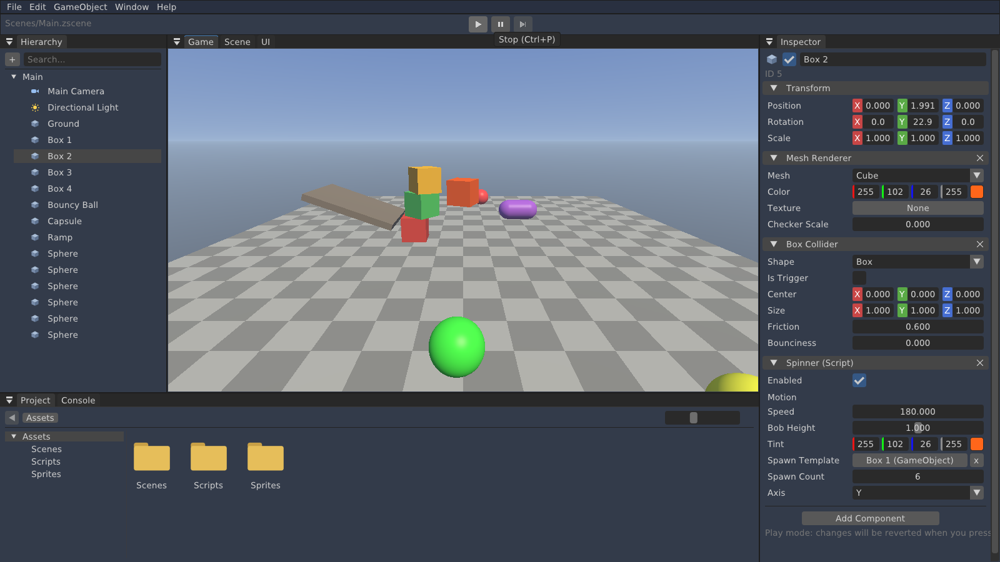
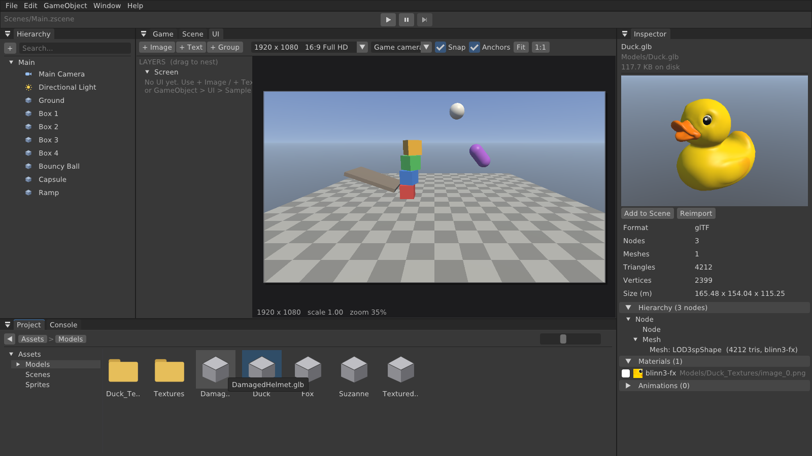
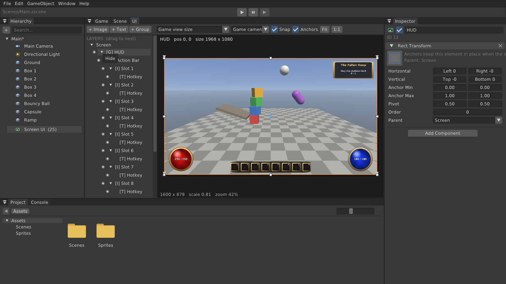

# IndeetsEngine

Игровой движок в стиле Unity: ядро на C++20 и Vulkan 1.3, физика Jolt, редактор на Dear ImGui, скрипты на C# с API UnityEngine.


## Возможности

**Редактор** (`IndeetsEngine-Editor`)
- Панели как в Unity: **Hierarchy**, **Inspector**, **Scene**, **Game**, **Project** (проводник по ассетам) и **Console**. Панели можно перетаскивать и стыковать, раскладка сохраняется (Window → Reset Layout сбрасывает её).
- Создание объектов: меню **GameObject** → Create Empty / 3D Object (Cube, Sphere, Capsule, Cylinder, Plane, Quad) / Light / Camera, кнопка «+» или ПКМ в Hierarchy.
- Inspector: имя, активность, Transform (позиция, поворот в градусах, масштаб), компоненты **Mesh Renderer**, **Box/Sphere/Capsule Collider**, **Rigidbody**, **Light**, **Camera**; кнопка **Add Component**, удаление компонента крестиком. Без выделения показываются настройки сцены (ambient, гравитация).
- Панель инструментов окна Scene (справа от Hierarchy): Move/Rotate/Scale, Local/Global, Snap, Grid, Colliders, Stats.
- **UI на экране игрока** редактируется в отдельной панели **UI**, а не в 3D-сцене (в Hierarchy весь интерфейс — одна строка «Screen UI»):
  - превью в любом разрешении: 1080p, 1440p, 4K, 720p, 21:9, 16:10, Steam Deck, 4:3 — сразу видно, что раскладка адаптивна;
  - перемещение и изменение размера мышью (8 маркеров), привязка к краям/центру родителя и экрана с направляющими, стрелки — сдвиг на 1 px (Shift — 10), колесо — зум, ПКМ/СКМ — панорама;
  - слои с вложенностью (перетаскивание в дереве), скрытие «глазом», порядок Bring to Front / Send to Back;
  - **Rect Transform** как в Unity: якоря с растяжкой (anchor min/max), пресеты 4×4 (Shift — пивот, Alt — позиция), Left/Right/Top/Bottom для растянутых осей, родитель; смена якорей не сдвигает элемент;
  - Canvas Scaler: Scale With Screen Size / Constant Pixel Size, reference resolution, match width/height.
- Компоненты **UI Image** (спрайт или цвет, Preserve Aspect, Set Native Size) и **UI Text** (латиница и кириллица, выравнивание, тень). GameObject → UI → Sample HUD создаёт адаптивный пример (сферы здоровья/маны, панель действий, окно задания).
- **Иерархия объектов (parent/child)**: перетаскивание в Hierarchy делает объект дочерним с сохранением положения в мире; Unparent, Move Up/Down, Create Empty Child. Трансформы локальные, физика и гизмо работают в мировых координатах.
- **Undo / Redo** (Ctrl+Z, Ctrl+Y / Ctrl+Shift+Z) для любых изменений сцены.
- **Префабы** (`*.zprefab`): перетащите объект из Hierarchy в Project (или ПКМ → Create Prefab); экземпляры подсвечены синим, в Inspector — Apply / Revert / Unpack; префаб можно редактировать прямо в Inspector по клику в Project — все экземпляры обновятся.
- **Импорт моделей FBX, OBJ, glTF/GLB** (ufbx, cgltf): узлы становятся объектами с иерархией, несколько материалов — дочерними объектами, текстуры находятся автоматически (встроенные извлекаются в папку `<Модель>_Textures`), единицы переводятся в метры, оси — в систему Unity.
- **Inspector ассетов**: клик по файлу в Project показывает превью (модель можно крутить мышью), для моделей — дерево узлов, меши, треугольники, материалы с текстурами, анимации; для картинок — размер, mip-уровни, память; для префабов — редактирование компонентов.
- Материалы: цвет + текстура (с mip-картами и анизотропной фильтрацией).
- Импорт: перетащите файлы из проводника Windows прямо в окно редактора — они скопируются в текущую папку Project. Картинки показываются превью.
- Scene view: выбор объектов кликом, гизмо **перемещения/поворота/масштаба** (W/E/R, Local/Global, привязка Snap или Ctrl), сетка, подсветка выделения, каркасы коллайдеров, иконки света и камер.
- **Play / Pause / Step / Stop**: в Play Mode работает физика и открывается окно Game; после Stop сцена возвращается к состоянию до запуска, как в Unity.
- Сцены хранятся в JSON (`*.zscene`) в папке `Project/Assets`: File → New / Open / Save / Save As, двойной клик по сцене в Project, запрос о несохранённых изменениях.
- Project: дерево папок, иконки, навигация, создание папок и сцен, переименование, удаление, «Show in Explorer».
- Console: все сообщения движка с фильтрами Info / Warnings / Errors.

**C#-скрипты** (подробно — [docs/SCRIPTING.md](docs/SCRIPTING.md))
- `MonoBehaviour` с API UnityEngine: Unity-скрипты компилируются без изменений в поддерживаемой части (GameObject, Transform, компоненты, корутины, `Invoke`, `Instantiate`/`Destroy`, физика с `OnCollision*`/`OnTrigger*`, `Input` и Input System, математика, `Time`, `PlayerPrefs`...).
- Жизненный цикл как в Unity: `Awake` → `OnEnable` → `Start` → `FixedUpdate` → `Update` → `LateUpdate` → `OnDisable` → `OnDestroy`, `[DefaultExecutionOrder]`, `[RuntimeInitializeOnLoadMethod]`.
- Компилятор C# встроен в редактор: сохранили `.cs` — через секунду скрипты перекомпилированы и подгружены без перезапуска; ошибки с файлом и строкой в Console, Play блокируется до исправления.
- Поля `public` / `[SerializeField]` в Inspector (включая массивы, списки, `[Serializable]`-классы, ссылки на объекты), `[Header]`, `[Range]`, `[Tooltip]`; в Play Mode — живые значения.
- Project → Create → C# Script, Add Component → Scripts, перетаскивание `.cs` на объект; .NET 8 входит в релизный архив.
- Ассеты из скриптов: `Resources.Load`, `ScriptableObject`, ссылки на префабы в полях, `Instantiate(prefab)`.

**Импорт Unity-проекта** (подробно — [docs/UNITY_PORTING.md](docs/UNITY_PORTING.md))
- Папку Unity-проекта можно открыть как проект: `IndeetsEngine-Editor --project <папка Unity-проекта>`. Необязательный `--scene <путь>` сразу открывает сцену.
- Двойной щелчок по `.unity` конвертирует сцену: объекты, иерархия, вложенные префабы с переопределениями, модели FBX, меши, материалы `.mat`, коллайдеры, свет, камера, теги, слои и поля скриптов со ссылками. Unity-префабы (`.prefab`) можно перетаскивать в Hierarchy.



**Движок**
- Оптимизация: отсечение объектов вне камеры (frustum culling), рендер только видимых панелей, кэш файловой системы в редакторе, без аллокаций на UI каждый кадр.
- Рендер на **Vulkan 1.3**: dynamic rendering, synchronization2, VMA, off-screen render targets для окон Scene/Game, процедурное небо, освещение Blinn-Phong, туман, редакторская сетка.
- **Физика Jolt Physics**: статические, динамические и кинематические тела, коллайдеры Box/Sphere/Capsule со смещением, трение, упругость, масса, затухание, триггеры, raycast.
- Unity-совместимые соглашения: левосторонняя система координат, +Y вверх, +Z вперёд, углы Эйлера Z-X-Y, цвета в sRGB.






## Горячие клавиши редактора

| Клавиши | Действие |
|---|---|
| ПКМ + WASD / Q E | полёт камеры (Shift — быстрее, колесо при полёте — скорость); сырой ввод мыши и сглаживание |
| СКМ | панорамирование, колесо — приближение |
| F / двойной клик в Hierarchy | показать выделенный объект |
| W / E / R | перемещение / поворот / масштаб |
| Ctrl+D, Delete, F2 | дублировать, удалить, переименовать |
| Ctrl+Z, Ctrl+Y | отменить, повторить |
| Ctrl+P, Ctrl+Shift+P | Play/Stop, пауза |
| Ctrl+S, Ctrl+Shift+S, Ctrl+N | сохранить, сохранить как, новая сцена |

## Готовая сборка

Скачайте архив из [Releases](https://github.com/zdaemon124/zdaemon124/releases), распакуйте и запустите `IndeetsEngine-Editor.exe`.

## Сборка из исходников (Windows 11)

1. Установите:
   - [Visual Studio 2022 или 2026](https://visualstudio.microsoft.com/) с нагрузкой **«Разработка классических приложений на C++»**;
   - [Vulkan SDK](https://vulkan.lunarg.com/sdk/home#windows);
   - [.NET 8 SDK](https://dotnet.microsoft.com/download/dotnet/8.0) — собирает управляемую часть движка (без него движок соберётся, но C#-скрипты будут отключены);
   - [Git](https://git-scm.com/download/win).
2. В «Developer PowerShell for VS»:

   ```powershell
   git clone https://github.com/zdaemon124/zdaemon124.git IndeetsEngine
   cd IndeetsEngine
   cmake --preset windows
   cmake --build --preset windows-debug
   .\build\bin\Debug\IndeetsEngine-Editor.exe
   ```

   Или откройте `build\IndeetsEngine.sln` (`.slnx` для VS 2026) и нажмите F5 — стартовый проект Editor.
3. Тесты без окна (C#-скрипты и импорт Unity-проекта): `ctest --test-dir build -C Debug --output-on-failure`.

## Структура

```
Engine/Source/IndeetsEngine/
  Core/      Application, Window, Input, Log, Platform
  Renderer/  VulkanContext, Swapchain, Pipeline, Renderer (render targets), Mesh
  Scene/     Scene, Entity, компоненты, Transform, Camera, Primitives, SceneSerializer
  Physics/   PhysicsWorld (Jolt), события контактов
  Assets/    импорт моделей, Unity YAML (.unity/.prefab/.asset/.meta), UnityImporter
  Scripting/ DotNetHost (hostfxr), ScriptEngine (мост C++ <-> C#, Play Mode), ProjectAssets
  UI/        ImGuiLayer
Engine/ScriptCore/  C#: API UnityEngine, рантайм MonoBehaviour, компилятор (Roslyn)
Engine/Shaders/  GLSL (Lit, Sky, Grid, Unlit)
Editor/          редактор
Sandbox/         демо без редактора
Tests/           тесты без окна: C#-скрипты, импорт Unity-проекта
```

## План

| Этап | Содержание | Статус |
|---|---|---|
| 1 | Окно, Vulkan-рендер, камера, примитивы, базовые шейдеры | ✅ |
| 2 | Редактор: Hierarchy, Inspector, Project, Console, Scene/Game, гизмо, сохранение сцен | ✅ |
| 3 | Физика Jolt: Rigidbody, коллайдеры, Play/Pause/Stop | ✅ |
| 3.5 | UI: спрайты и текст на экране, импорт файлов | ✅ |
| 4 | C#-скрипты (.NET 8): API UnityEngine, `MonoBehaviour`, корутины, `OnCollision*`/`OnTrigger*`, горячая перезагрузка | ✅ |
| 4.5 | Импорт Unity-проекта: сцены, префабы, `.meta`, `.mat`, `ScriptableObject`, `Resources.Load` | ✅ |
| 5 | Иерархия объектов (parent/child), Undo/Redo, префабы | ✅ |
| 6 | Материалы и текстуры, загрузка моделей FBX/OBJ/glTF, Inspector ассетов | ✅ (тени — далее) |
| 7 | Суставы (joints) и регдоллы, декали, сборка игры в .exe | ⏳ |

План переноса Unity-проекта (что нужно движку, чтобы игра работала как в Unity): [docs/UNITY_PORTING.md](docs/UNITY_PORTING.md).
