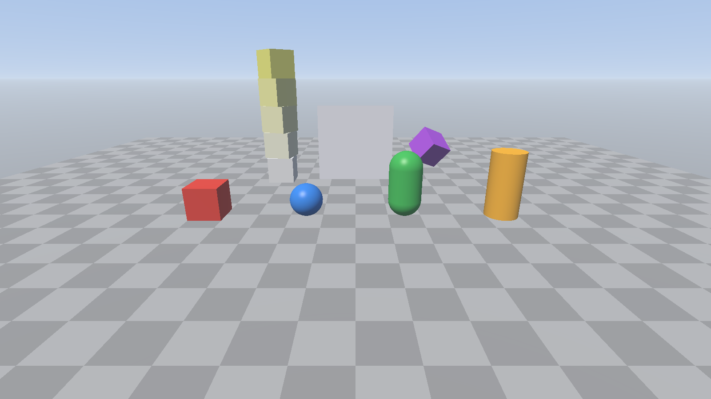

# ZEngine

Игровой движок в стиле Unity: ядро на C++20 и Vulkan 1.3, скрипты игр на C# (в разработке).



## Что уже есть (этап 1)

- Рендер на **Vulkan 1.3**: dynamic rendering, synchronization2, VMA для памяти, 2 кадра в полёте, пересоздание swapchain при изменении размера окна.
- Встроенные примитивы, как `GameObject.CreatePrimitive` в Unity: **Cube, Sphere, Capsule, Cylinder, Plane, Quad** (те же размеры по умолчанию).
- Базовые шейдеры: освещение Blinn-Phong от направленного света, полусферический ambient, туман, процедурное небо с солнцем.
- Камера сцены как в Unity: **ПКМ + WASD/QE** — полёт (Shift ускоряет), **СКМ** — панорамирование, **колесо** — приближение.
- Ввод в стиле Unity: `Input::GetKey / GetKeyDown / GetKeyUp`, мышь.
- Система координат как в Unity: левосторонняя, +Y вверх, +Z вперёд, углы Эйлера в порядке Z-X-Y.
- В Debug-сборке включаются слои валидации Vulkan (если установлен Vulkan SDK).

## Сборка на Windows 11

1. Установите:
   - [Visual Studio 2022](https://visualstudio.microsoft.com/) с нагрузкой **«Разработка классических приложений на C++»** (CMake входит в её состав);
   - [Vulkan SDK](https://vulkan.lunarg.com/sdk/home#windows) (нужен компилятор шейдеров `glslc` и слои валидации);
   - [Git](https://git-scm.com/download/win);
   - свежий драйвер NVIDIA.
2. Склонируйте репозиторий и соберите проект (в «Developer PowerShell for VS 2022»):

   ```powershell
   git clone https://github.com/zdaemon124/zdaemon124.git ZEngine
   cd ZEngine
   cmake --preset vs2022
   cmake --build --preset vs2022-debug
   .\build\bin\Debug\Sandbox.exe
   ```

   При первой конфигурации CMake сам скачает зависимости (GLFW, volk, VMA, GLM, Vulkan-Headers).

   Можно и без консоли: откройте `build\ZEngine.sln` в Visual Studio и нажмите F5 (стартовый проект — Sandbox).

Управление в Sandbox: ПКМ + WASD/QE — полёт, СКМ — панорама, колесо — зум, Space — пауза анимации, Esc — выход.

## Структура

```
Engine/
  Source/ZEngine/
    Core/      Application (главный цикл), Window, Input, Log, Platform
    Renderer/  VulkanContext, Swapchain, Pipeline, Renderer, Mesh
    Scene/     Scene, Entity, Transform, Camera, Primitives
  Shaders/     GLSL-шейдеры (компилируются в SPIR-V при сборке)
Sandbox/       демо-приложение
cmake/         зависимости и компиляция шейдеров
```

## План

| Этап | Содержание | Статус |
|---|---|---|
| 1 | Окно, Vulkan-рендер, камера, примитивы, базовые шейдеры | ✅ |
| 2 | Материалы и текстуры, тени (shadow maps), загрузка моделей (glTF) | ⏳ |
| 3 | Редактор на Dear ImGui: Hierarchy, Inspector, Scene/Game view, гизмо, сохранение сцен | ⏳ |
| 4 | Физика Jolt: Rigidbody, коллайдеры, триггеры, рэйкасты, регдоллы | ⏳ |
| 5 | C#-скрипты (.NET 8): `MonoBehaviour`, `Start/Update/OnCollisionEnter`, горячая перезагрузка | ⏳ |
| 6 | Play Mode: Play/Pause/Stop со снимком и восстановлением сцены | ⏳ |
| 7 | Декали, сборка игры в отдельный .exe | ⏳ |
